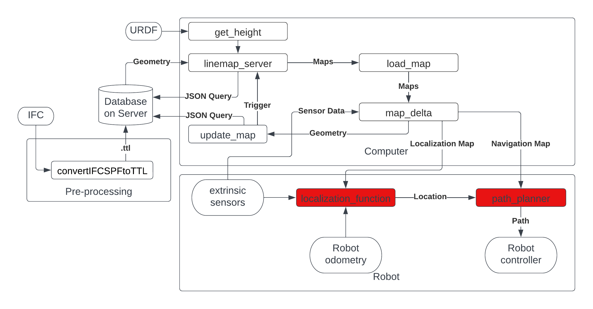

# 2022-SEMB-Q3Q4: AIES Challenge: Integrated Building Information Models and Robotics


## Description

Detailed 3D Building Information Models are available in Revit. Standard practice in the building industry makes such BIM models available. While Revit is a proprietary (closed) commercial BIM tool, a neutral data model and file format is available as well, namely the Industry Foundation Classes (IFC). Such information needs to be made available to robots to ease their localisation and navigation. That is your challenge. This is tested in a barn environment, where agricultural robots need to be able to navigate in their environment and perform actions with cattle present inside the barn. This challenge is based on earlier work, that can be previewed here: https://www.youtube.com/watch?v=b7LKU3C6gCQ.

The structure of the project is detailed bellow, for more information on the challenge scroll to the Project Assignment part of the README.

For more information about this repository and the work it contains please read the paper: Leveraging BIM Models for Skill-Specific Robot Navigation and Localization.

# Project structure

## High level overview of the project




This project is mainly divided into 4 parts, the pre-processing, the server, the computer/software and the robot control.

The inputs to the poject structure, namely the IFC files and the URDF files. 
These can be found in the following directories:

IFC files --> [BIM_models](BIM_models), where you will find the IFC of atlas, a barn and the test_setup which was used for this project.

URDF file --> [ros_package/rosbot_description/src/rosbot_description/urdf](ros_package/rosbot_description/src/rosbot_description/urdf), where rosbot.xacro is the URDF file of the rosbot used in the project. 

## Requirements
This  project requires a lot of different types of software. Software that it is tested on is listed below:
- Go (programming language) version 1.20.4 linux/amd64
- Graphdb
- Ros melodic
- Ubuntu 18.04
- python 2.7
- pip2 


## Installation

### General software installation
A lot of software has to be downloaded to run this project. The installation of the different software is explained below. This may take a couple of hours. 

To install Go please follow the instructions on the official website: https://golang.org/doc/install.  Follow the installation instruction 
<b>do <em>not</em> try to install it with apt-get</b>, this is known to create broken installations. 

To install Graphdb please follow the instructions on the official website: https://www.ontotext.com/products/graphdb/download/.

To install ROS melodic please follow the instructions on the official website: http://wiki.ros.org/melodic/Installation/Ubuntu.

python2.7 should be installed by default on Ubuntu 18.04. Download pip through the official documentation: https://pip.pypa.io/en/stable/installation/. Make sure to download pip for python2.7 and not for python3. 


### python packages installation
Download the following python packages with pip:
| package      | version |
|--------------|---------|
| - numpy      | 1.13.3  |
| - scipy      | 0.19.1  |
| - matplotlib | 2.1.1   |
| - pyyaml     | 3.12    |
| - requests   | 2.27.1  |
| - shapely    | 1.7.1   |

Please take a look at the requirements.txt file in the root of the repository for the complete list of all packages that we used, not all of these are used but may be useful for reference.

<b>Pymesh</b> is less simple to install: Please follow the instructions on the official website: https://pymesh.readthedocs.io/en/latest/installation.html. We had some troubles installing this package, the following worked for us:
- Follow the instructions until the <b> building pymesh </b> part of the documentation.
- Here first download cmake <b>but</b> follow the Build with Setuptools method. 

We know this is strange, but this is the only way we could get it to install. This installation process takes a long times $\approx 30$ min.


# Running the demo
The demo uses all the different parts of the project except TTL creation. Please very carefully follow the installation instructions above. We are not generating new TTL files for this but using the one that are already in the repository. To create a new TTL please follow the instructions in the README of the map_generation directory.

Note that if we use <> you have to fill in your own information like so. ``<fill your own path>``

To start running the demo please follow the instructions below:
- With the ubuntu application manager start graphdb. 
- Make sure that you have loaded the correct ttl file into graphdb with the name Project. For the full instructions <b> Setup of database </b> part of the README in the ``server`` directory.
- Open a terminal and navigate to the server directory.
 ``cd <path to repository>/server``
- Run the server with the command: ```go run .``` if this works you should get the message ``server running``
- Open a new terminal and navigate to the map_generation director 
and source the setup.sh file with the command: ``source <catkin_workspace>/devel/setup.sh``. 
- Start gazebo and rviz: ``roslaunch rosbot_description rosbot_rviz.launch``
- Open a new terminal and source again the setup.sh file with the command: ``source <catkin_workspace>/devel/setup.sh``.
- Start the amcl and path planning nodes:  ``roslaunch rosbot_navigation amcl_and_path.launch`` 
- Open a new terminal and source again the setup.sh file with the command: ``source <catkin_workspace>/devel/setup.sh``.
- Start the map delta script with the command: ``rosrun rosbot_navigation map_delta.pymap_delta.py --plot_delta True``
- If you add an object to the gazebo environment you should see the map delta script detect this and update the map.
- To display these changes in rviz restart the map server: 
- Open a new terminal and source again the setup.sh file with the command: ``source <catkin_workspace>/devel/setup.sh``.
- Restart the map_server ``roslaunch rosbot_navigation map_launcher.launch``
- Now the changes detected by the map delta script should be visible in rviz.


### Pre-processing

The pre-processing setps converts the IFC files to TTL files to then store them in the server. For more information please refer to the README in the specific directory.

The pre-processing code --> [IFCtoLBD](IFCtoLBD) 


### Server

The server stores the TTL files which contain the geometry of the building environments that will be used to create the different maps. For more information please refer to the README in the specific directory.

The server code --> [server](server)


### Computer/software
For all the code relating to the software part please refer to the map generation directory.

The map generation code --> [map_generation](map_generation)


### Robot control

The robot control part includes the implementation of ROS packages to make the robot navigate and localize in the building environments. For more information please refer to the README in the specific directory.

The robot control --> [ros_package](ros_package)


