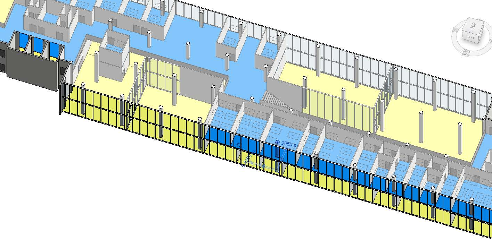
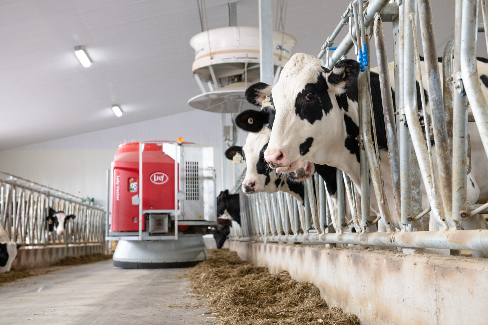
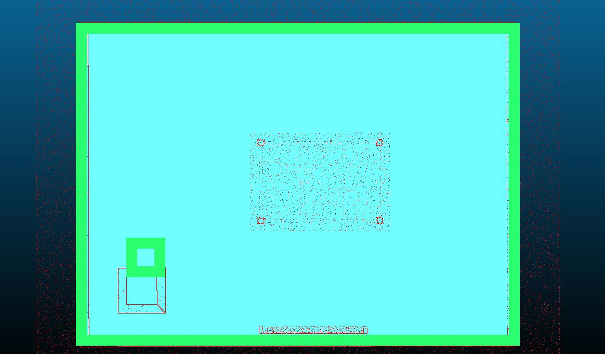

# 2022-SEMB-Q3Q4: AIES Challenge: Integrated Building Information Models and Robotics

## Description

Detailed 3D Building Information Models are available in Revit. Standard practice in the building industry makes such BIM models available. While Revit is a proprietary (closed) commercial BIM tool, a neutral data model and file format is available as well, namely the Industry Foundation Classes (IFC). Such information needs to be made available to robots to ease their localisation and navigation. That is your challenge. This is tested in a barn environment, where agricultural robots need to be able to navigate in their environment and perform actions with cattle present inside the barn. This challenge is based on earlier work, that can be previewed here: https://www.youtube.com/watch?v=b7LKU3C6gCQ.

The structure of the project is detailed bellow, for more information on the challenge scroll to the Project Assignment part of the README.

For more information about this repository and the work it contains please read the paper: Leveraging BIM Models for Skill-Specific Robot Navigation and Localization.

# Project structure

## High level overview of the project

This project is mainly divided into 4 parts, the pre-processing, the server, the computer/software and the robot control.

The inputs to the poject structure, namely the IFC files and the URDF files. 
These can be found in the following directories:

IFC files --> [BIM_models], where you will find the IFC of atlas, a barn and the test_setup which was used for this project.

URDF file --> [ros_package/rosbot_description/src/rosbot_description/urdf], where rosbot.xacro is the URDF file of the rosbot used in the project. 

### Pre-processing

The pre-processing setps converts the IFC files to TTL files to then store them in the server. For more information please refer to the README in the specific directory.

The pre-processing code --> [IFCtoLBD] 

### Server

The server stores the TTL files which contain the geometry of the building environments that will be used to create the different maps. For more information please refer to the README in the specific directory.

The server code --> [server]

### Computer/software

The slicing code --> [Slicing]

The map generation code --> [map_generation]

### Robot control

The robot control part includes the implementation of ROS packages to make the robot navigate and localize in the building environments. For more information please refer to the README in the specific directory.

The robot control --> [ros_package]

# Project assignment
## Knowledge graph generator for BIM models
### what is a BIM model
3D BIM models are available. They have different shapes and levels of detail. They are commonly built in [Autodesk Revit](https://www.autodesk.eu/products/revit/architecture) (free version for students). The Revit models are typically exported to software-neutral IFC files. Sample RVT and IFC models are available for a Barn model here in the repository:

- RVT: [file](BIM%20models/Barn)
- IFC: [file](BIM%20models/Barn)

The IFC file can be generated anew from Revit also. IFC files can be viewed in an open viewer: https://view.ifcopenshell.org/.

### knowledge graph generation
These IFC files can be transformed into knowledge graphs (RDF graphs in TTL format) using an open IFCtoLBD Python converter that is available here:
https://github.com/ISBE-TUe/IFCtoLBD. This leads to a graph (TTL file) that can be loaded into a graph databases, such as [OntoText GraphDB](https://graphdb.ontotext.com/).

While you work on the Barn model first and foremost, similar sample data (RVT, IFC, TTL) is also available here for the Atlas building :
https://github.com/ISBE-TUe/atlas-building-graph

### challenge
While a lot of sample algorithms are available, it is your challenge to bring these together in your solution, and extend these software so that they respond to the data needs for robot navigation and localization (see next steps).

## High quality digital twin that includes good 2D and 3D geometry
### how to represent 2D and 3D geometry in a knowledge graph
The resulting RDF graph or knowledge graph contains lots of semantic data. It needs to be enriched with the geometry at specific heights (z-levels) so that the robot can use this data in its 2D navigation and localization maps / plans.

An indication of how geometry can be stored in a knowledge graph is available in the following examples:
- de Koning, R., Torta, E., Pauwels, P., Hendrikx, R. W. M., & van de Molengraft, M. J. G. (2021). Queries on Semantic Building Digital Twins for Robot Navigation. In 9th Linked Data in Architecture and Construction Workshop (pp. 32-42). (CEUR Workshop Proceedings; Vol. 3081). CEUR-WS.org. http://ceur-ws.org/Vol-3081/03paper.pdf

An indication of how geometry can be extracted from an IFC model (using IfcOpenShell) is available here in a Python Notebook: [Examples/DataExtractionFromIFC](Examples/DataExtractionFromIFC)

### challenge
Obtaining this geometry can be achieved in a number of ways and using a number of tools. This is part of your challenge. The resulting representation needs to become available in / via the knowledge graph.

## Creation of robot-specific navigation and localization maps
### creating robot maps
From the IFC and knowledge graphs, navigation and localization maps can be built. For reference, you can look into the below material:

- de Koning, R., Torta, E., Pauwels, P., Hendrikx, R. W. M., & van de Molengraft, M. J. G. (2021). Queries on Semantic Building Digital Twins for Robot Navigation. In 9th Linked Data in Architecture and Construction Workshop (pp. 32-42). (CEUR Workshop Proceedings; Vol. 3081). CEUR-WS.org. http://ceur-ws.org/Vol-3081/03paper.pdf
- Hendrikx, B., Pauwels, P., Torta, E., Bruyninckx, H. P. J., & van de Molengraft, M. J. G. (2021). Connecting Semantic Building Information Models and Robotics: An application to 2D LiDAR-based localization. In 2021 IEEE International Conference on Robotics and Automation, ICRA 2021 (pp. 11654-11660). [9561129] Institute of Electrical and Electronics Engineers. https://doi.org/10.1109/ICRA48506.2021.9561129
- Article Aiyu [under review]
- Article Pieter [under review]

The following python code shows an example of how such maps could be generated: [Examples/GeneratedGridMaps](Examples/GeneratedGridMaps)

### challenge
Embed the given datasets into robot localization and navigation systems, and find a good balance between server-side information, information in ROS, and telemetry data from the robot (laser scans).

## Enable navigation and task execution (validation)
### from similation to reality
Up to this point, the challenge can be solved using simulators (e.g. Gazebo) and file-based exchange. It needs to be validated in a case that is as realistic as possible, yet does include a specific building and a robot. At this point, there is no such predefined location yet. This can be found as part of the project challenge. This location needs to match with the case of agricultural robots in barns (see [Lely robots](https://www.lely.com/) - left side of below image).

### challenge
Perform a structured and realistic experiment that validates your work: a demonstrator. Point clouds and BIM models (RDF graphs) are compared, and navigation is improved / optimized.

## Update the BIM model based on metrics obtained by robot
### Oh we have a faulty BIM model
In many cases, a BIM model does not match in detail with the point cloud model. Of course, moving objects like people and doors are impossible to account for in a BIM model, but also more structural discrepancies exists, such as walls that are slightly in the wrong position, doors that have been added, etc. So your end solution needs to expect such faulty data, as this is not (or hardly) resolvable in practice. And even if it were solvable, safety mechanisms need to be in place.

Information about this topic can be found here:
- Article Koen [under review]
- [references/R_D-Report_Student1760602.pdf](R&D Report Jean van der Meer)

### challenge
Show how changes in the built environment (displaced wall) can be detected, and reported to the knowledge graph.

# Support
Are you stuck, then get help with p.pauwels@tue.nl or e.torta@tue.nl.

# Contributing
Contributions are restricted to students of the AI&ES Master program that take on this challenge.

# License
This code needs to stay private.
