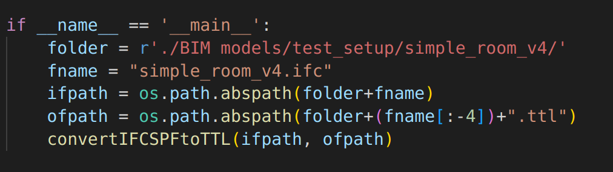
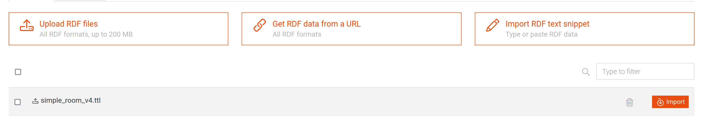

# Server

This is the server side of the project. The goal of the server is to provide querying of the data from the graph database as well as updating the database. The server is written in relatively young language named Golang (Go). One could ask why Go and the answer is the enthusiasm for learning new things as well as a very high demand for Go in the industry lately. It is one of the fastest growing language with very good documentation! It provides a really good platform for concurrent programming and finally it is low-level language. The main thing that engineers managed to do with Go is fast compiling (this is one of the benefits over C++). The resources for learning Go are documentation and [tour of Go](https://go.dev/tour/welcome/1).

You can follow the instructions from the official [website](https://go.dev/doc/install) to install Go.

P.S. the best thing about Go is that it is open source!

## What is server?

A server is a computer. It is very important part of every web application, because it has a communication with a database, it executes code that is high demanding... Servers communicate with their clients using APIs. For example when a user wants to connect to their account on Facebook, at the moment when user clicks "Log in" button the API is sent to one of the Facebook servers, where the server checks if the username and password are the same as in the database and sends the respondse also as an API.

In our project it should be like: Robot sends API to get the needed data, server queries the database and sends the response back to the robot. The database should be updated similarly.

APIs are sent using the HTTP protocol, which uses the IP addresses of the server and robot. The IP address is unique for every machine in the world.

## How to use the server?

You should open this folder in a new workspace and run the following command:

```bash 
$ go run .
```
This command should be running and waiting for http requests. If you take a look at the code the function ListenAndServe waits for the request and responds in the proper way. How it will respond depends on the handlers.

As the server is a computer, one wants to run several processes. Maybe the creator wants to use these processes and make them to communicate. Exactly this happens in this case, because we want that our server to communicate with the database which is on the port 7200 when you run it. Behind the scenes when we run the database, actually the database server is run. So every time when robot sends API to our server, it is forwarded to the database server. The APIs for graphDB can be found in their documentation, https://graphdb.ontotext.com/documentation/10.0/pdf/GraphDB.pdf#24e. We can not just make a client on the robot side that will send queries to the graphDB server, because this is not secure and robot does not have enough power to process the data quickly. Therefore we need our own server that will communicate with both robot and database.

## Quering database

To get the data from the database, you can send POST request to the server. The API is 

```bash
localhost:9090/select
```
and you should also provide a JSON with query like this:
```
{
    "query": <select_query>
}
```

In order to make an update to database the API is

```bash
localhost:9090/update
```
and the JSON is the same as for select API:
```
{
    "query": <select_query>
}
```

## Setup of Database

In order to setup the database you should download the graphDB software. Before running a server, you should run graphDB software. The repository has to be named `Project` in the GraphDB. You have to provide ttl file to repository in graphDB, which can be generated using IFCtoLBD code.

After making the repository named `Project`, next thing is adding a ttl file. To make a ttl file use a script `IFCtoLBD/IFCtoLBDWGeometry.py` and provide a path to the ifc file (at the end of the file there are two variables `folder` and `filename`, which has to be changed). In the same folder the new ttl file will be generated. Look at the example to the second and third line.



In the repository `Project` you should add your ttl file. Pick the option `Upload RDF files` and navigate to the ttl file. There should appear new file and on the right side should appear option import like on the following image.



After clicking the import button pick the `The default graph` option and import the data. The data should appear in the option `Graph overview` under the `Explore` section. Enjoy your time with the server and GraphDB :).
